# Project Documentation: Deployment of MEAN Stack on EC2 Instance.

## Overview

This project is a documentation guide for setting up a MEAN (MongoDb,ExpressJs,Angular.js,NodeJs) stack on an Amazon EC2 instance. The MEAN stack is a popular web development environment that provides the necessary components to run dynamic websites and web applications using Javascript technologies.

### Components

- **MongoDB:** a no-sql database that store data inform of documents
- **ExpressJs:** a serverside web application javascript framework
- **Angular:** a frontend Javascript framework used for UI(user interface) design.
- **NodeJs:** a runtime environment that allows javascript to run on machine instead of browsers.

## Setting up the EC2 Instance

1. **Launch an EC2 Instance**: 
   - Sign in to the AWS Management Console.
   - Navigate to EC2 Dashboard.
   - Click on "Launch Instance" and choose Ubuntu Server 24.04 LTS as the operating system.


2. **Configure Instance Details**:
   - Choose instance type, network, subnet, and other settings as per your requirements.

3. **Add Storage**:
   - Allocate storage space according to your needs.

4. **Add Tags**:
   - Optionally, add tags for better organization.
5. **Configure Security Group**:
   - Create a new security group or use an existing one.
   - Allow inbound traffic on ports 80 (HTTP), 22 (SSH), and 443 (HTTPS) from your IP address
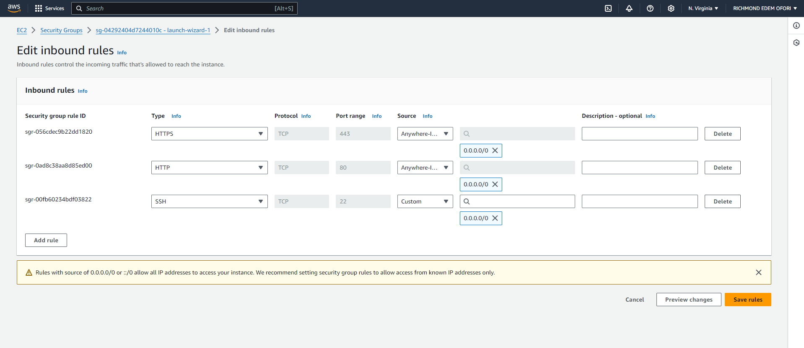

6. **Review and Launch**:
   - Review the configuration and launch the instance.
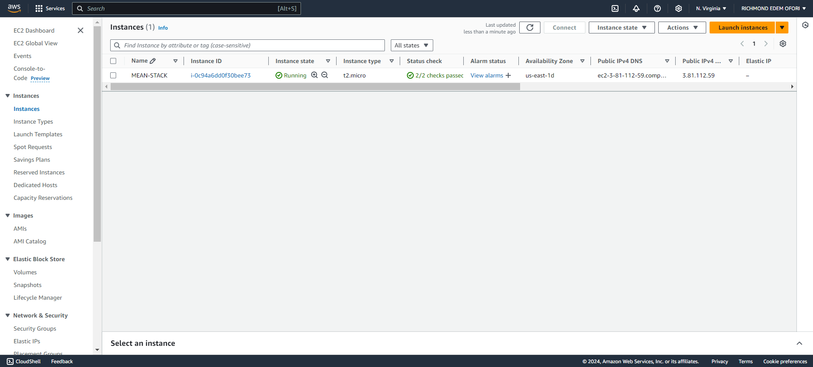

7. **Connect to the Instance**:
   - Use windows terminal to connect to the instance via SSH.


8. **SSH to the instance**
```
ssh -i "MEAN.pem" ubuntu@<public DNS>
```
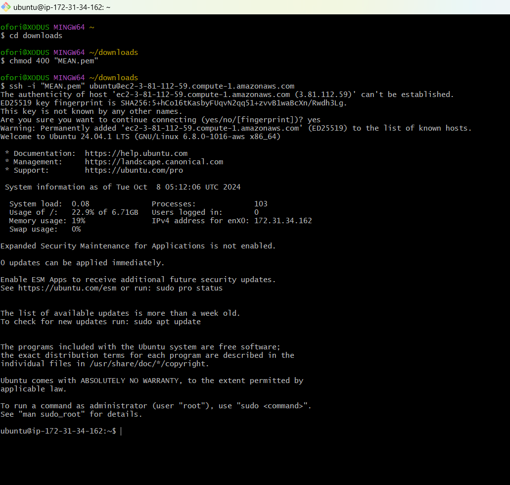

## Installing MEAN Stack
**In this project we are going to implement a simple book register**
## Step 1: Install nodejs

1. Update and Upgrade Ubuntu
```bash
sudo apt update
sudo apt upgrade
```
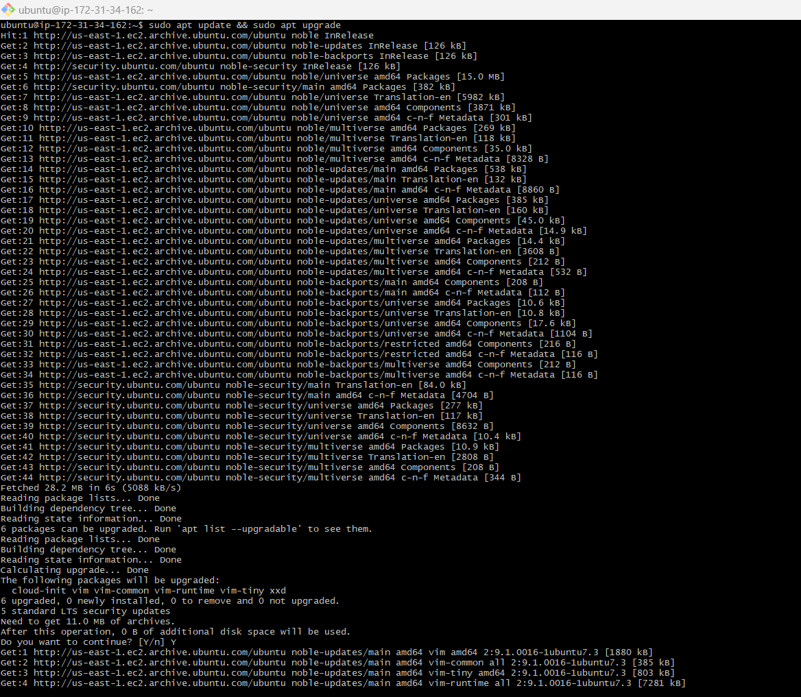

2. Add certificates and Node.js repository:
```bash
sudo apt -y install curl dirmngr apt-transport-https lsb-release ca-certificates

curl -sL https://deb.nodesource.com/setup_18.x | sudo -E bash -
```
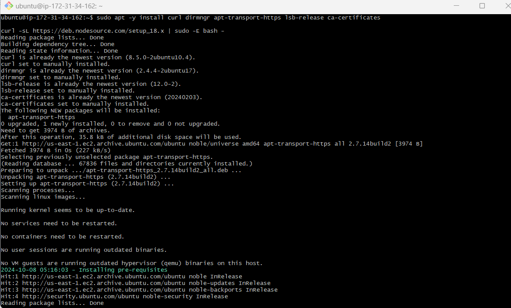

3. Install nodeJs:

```bash
sudo apt install -y nodejs
```
The above commands will install Node.js and npm (Node Package Manager).

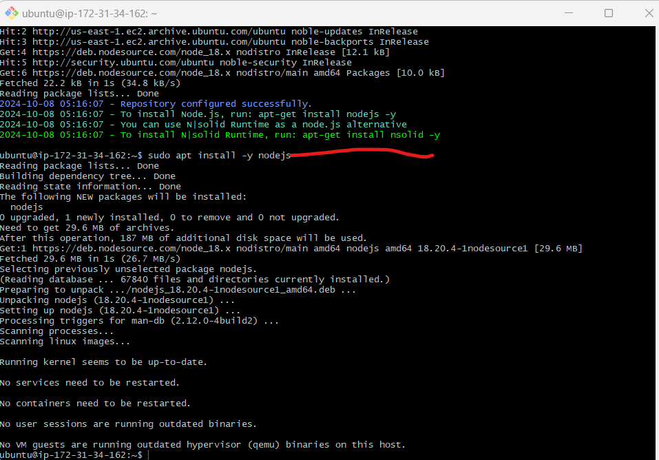

---

## Step 2 -  Install MongoDB
1. Download the GPG key for MongoDB:

```bash
 sudo apt-get install -y gnupg curl 
 curl -fsSL https://www.mongodb.org/static/pgp/server-7.0.asc | \ sudo gpg -o /usr/share/keyrings/mongodb-server-7.0.gpg \ --dearmor
 ```
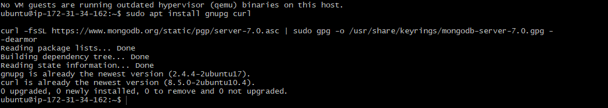

2. Add the MongoDB repository to your system's package sources list:

 ```bash
echo "deb [ arch=amd64,arm64 signed-by=/usr/share/keyrings/mongodb-server-7.0.gpg ] https://repo.mongodb.org/apt/ubuntu jammy/mongodb-org/7.0 multiverse" | sudo tee /etc/apt/sources.list.d/mongodb-org-7.0.list
```
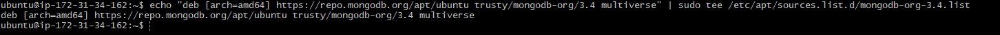

3. Install MongoDB
```bash
sudo apt-get install -y mongodb-org
```

- Running the above command failed to install MongoDB, due to an outdated package list.
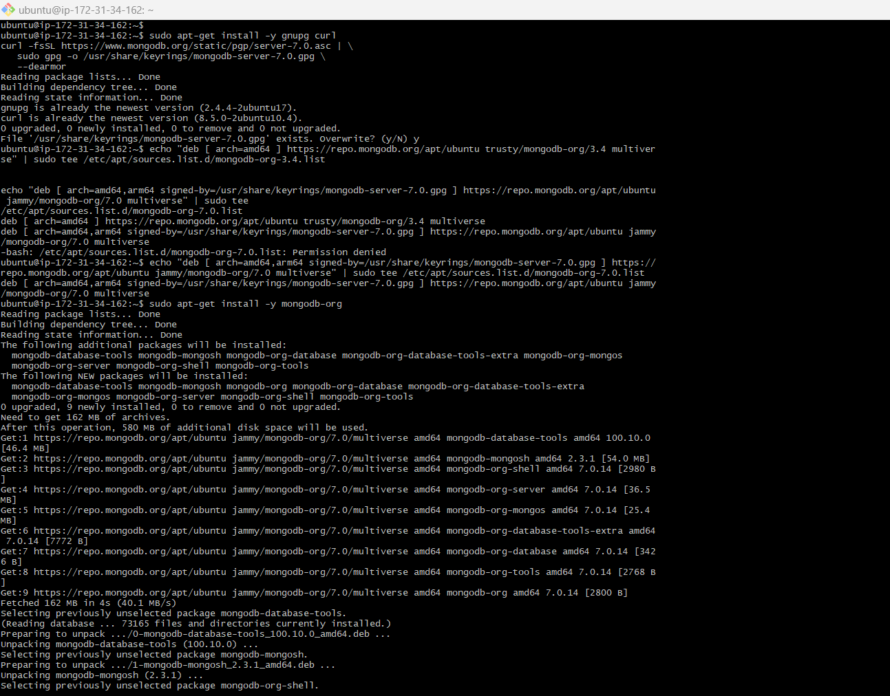

- To fix the above issue, simply run the command below to update the package list :
```bash 
sudo apt update
```

- Then the  MongoDB install command again
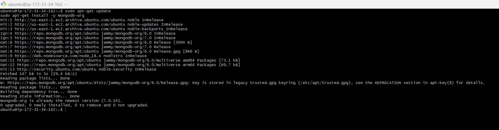

4. Start and enable the MongoDb service with the following commands:
```bash
sudo systemctl start mongod
```
```bash
sudo systemctl enable mongod
```
```bash
sudo systemctl status mongod
```

5. Install Body parser, which is used to handle form submissions and JSON data sent in POST requests:
```bash
sudo npm install body-parser
```

6. Create a new folder and name it 'Books', change the directory to the Books directory:

```bash
mkdir Books && cd Books
```

7. In the Books directory, Initialize the npm project:

```bash
npm init
```

8. Add and open a file to it named server.js:
```bash
touch server.js && vim server.js
```

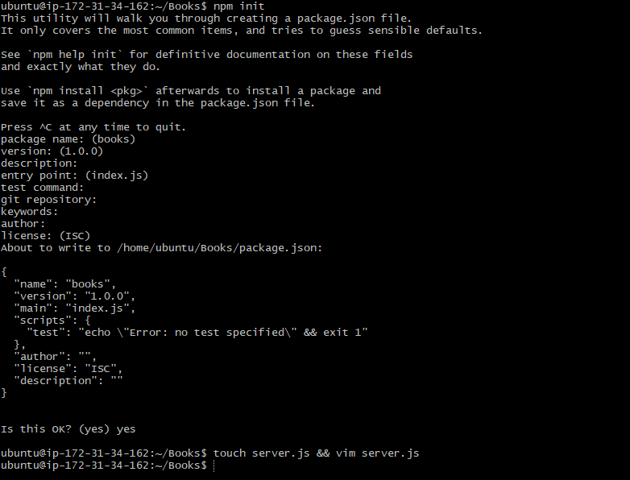

9. Add the code below to server.js:
```js
const express = require('express');
const bodyParser = require('body-parser');
const mongoose = require('mongoose');
const path = require('path');

const app = express();
const PORT = process.env.PORT || 3300;

// MongoDB connection
mongoose.connect('mongodb://localhost:27017/test', {
  useNewUrlParser: true,
  useUnifiedTopology: true,
})
.then(() => console.log('MongoDB connected'))
.catch(err => console.error('MongoDB connection error:', err));

app.use(express.static(path.join(__dirname, 'public')));
app.use(bodyParser.json());

require('./apps/routes')(app);

app.listen(PORT, () => {
  console.log(`Server up: http://localhost:${PORT}`);
});
```
save and exit

---


##  Step 3 - Install Express and Setup routes to the server
Express will be used to pass book information to and from our MongoDB database.

Mongoose will be used to establish a schema for the database to store data of our book register.

1. Install Express:
```bash
sudo npm install express mongoose
```
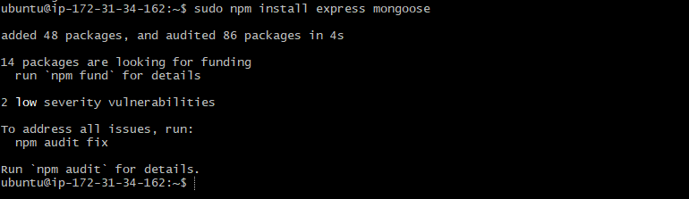

2. In the Books directory create a folder named apps:
```bash
mkdir apps && cd apps
```
3. In apps folder, create a new file called routes.js:

```bash
vi route.js
```
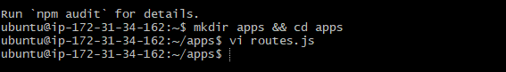

4. Add the code below to routes.js:

```js
const Book = require('./models/book'); // Import the Book model
const path = require('path'); // Import path module for serving static files

module.exports = function(app) {
    
    // GET request to fetch all books
    app.get('/book', async (req, res) => {
        try {
            const books = await Book.find(); // Fetch all books from the database
            res.json(books); // Send the books as a JSON response
        } catch (err) {
            res.status(500).json({ message: 'Error fetching books', error: err.message }); // Handle errors
        }
    });

    // POST request to add a new book
    app.post('/book', async (req, res) => {
        try {
            const book = new Book({
                name: req.body.name, // Book name from request body
                isbn: req.body.isbn, // ISBN from request body
                author: req.body.author, // Author from request body
                pages: req.body.pages // Pages from request body
            });
            const savedBook = await book.save(); // Save the new book to the database
            res.status(201).json({ message: 'Successfully added book', book: savedBook }); // Send success response
        } catch (err) {
            res.status(400).json({ message: 'Error adding book', error: err.message }); // Handle errors
        }
    });

    // DELETE request to delete a book by its ISBN
    app.delete('/book/:isbn', async (req, res) => {
        try {
            const result = await Book.findOneAndDelete({ isbn: req.params.isbn }); // Find and delete book by ISBN
            if (!result) {
                return res.status(404).json({ message: 'Book not found' }); // Handle case where book is not found
            }
            res.json({ message: 'Successfully deleted the book', book: result }); // Send success response
        } catch (err) {
            res.status(500).json({ message: 'Error deleting book', error: err.message }); // Handle errors
        }
    });

    // Catch-all route to serve the frontend application (SPA)
    app.get('*', (req, res) => {
        res.sendFile(path.join(__dirname, '../public', 'index.html')); // Serve index.html for any non-API routes
    });
};
```
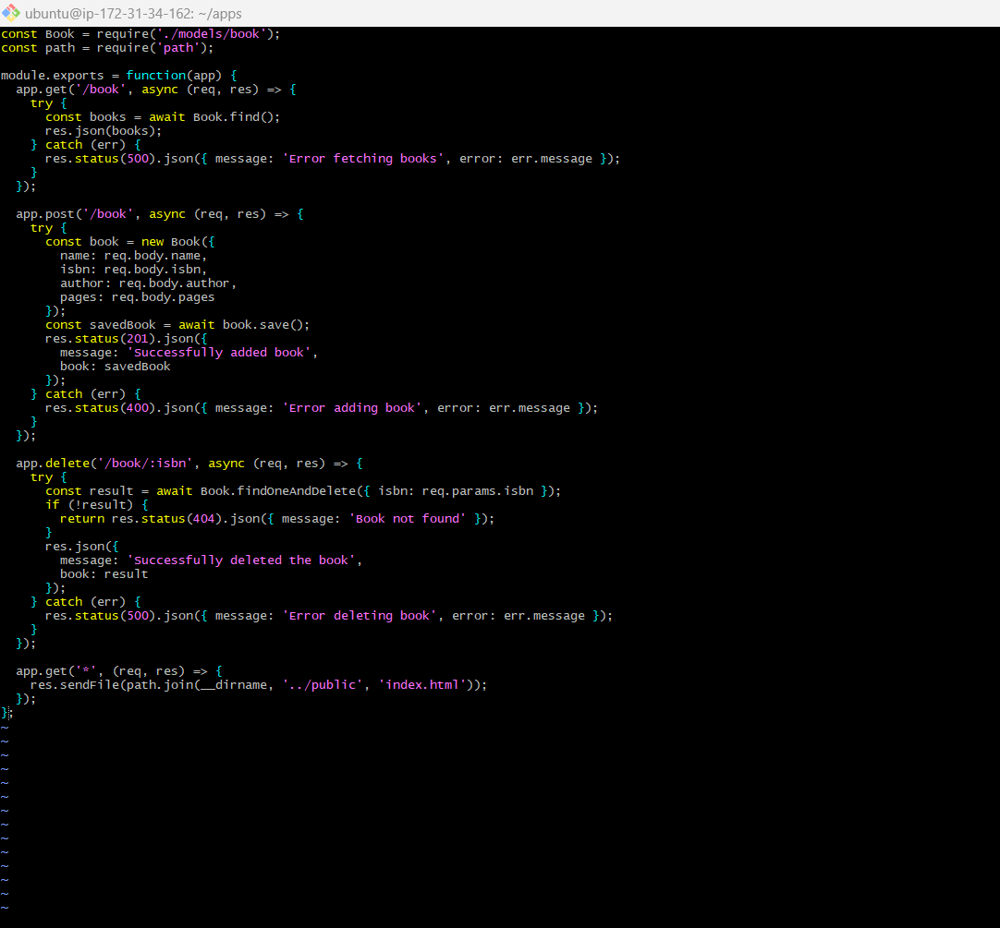

5. In the apps folder, create a new folder called models:
```bash
mkdir models && cd models
```
6. Create a new file called book.js
```bash
vi book.js
```
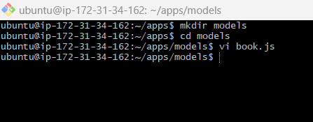

7. Add the code below to book.js

```js
const mongoose = require('mongoose'); // Import mongoose for MongoDB interaction

// Define the book schema
const bookSchema = new mongoose.Schema({
    name: { type: String, required: true }, // Book name is required
    isbn: { type: String, required: true, unique: true, index: true }, // ISBN is required, unique, and indexed
    author: { type: String, required: true }, // Author name is required
    pages: { type: Number, required: true, min: 1 } // Number of pages is required and must be at least 1
}, { 
    timestamps: true // Automatically add createdAt and updatedAt fields
});

// Export the Book model based on the schema
module.exports = mongoose.model('Book', bookSchema);
```
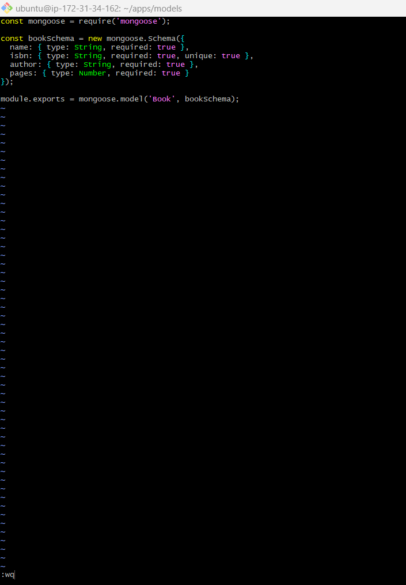


---

## Access the routes with AngularJs

AngularJS provides a web framework for creating dynamic views in your web applications.

1. Change the directory back to the 'Books' folder, and create a new folder called public:
```bash
mkdir public && cd public
```
2. In the public folder add a file named script.js:
```bash
vi script.js
```
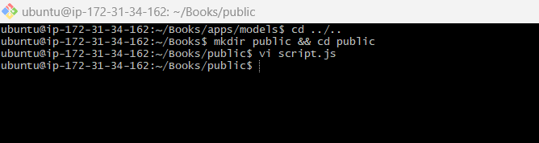

3. Add the code below to script.js:
```js
angular.module('myApp', []) // Define an AngularJS module
.controller('myCtrl', function($scope, $http) { // Define a controller

    // Function to fetch all books
    function fetchBooks() {
        $http.get('/book')
        .then(response => {
            $scope.books = response.data; // Store fetched books in $scope
        })
        .catch(error => {
            console.error('Error fetching books:', error); // Handle fetch errors
        });
    }

    fetchBooks(); // Initial fetch of books when the controller loads

    // Function to delete a book by its ISBN
    $scope.del_book = function(book) {
        $http.delete(`/book/${book.isbn}`)
        .then(() => {
            fetchBooks(); // Refresh book list after deletion
        })
        .catch(error => {
            console.error('Error deleting book:', error); // Handle delete errors
        });
    };

    // Function to add a new book
    $scope.add_book = function() {
        const newBook = { 
            name: $scope.Name, 
            isbn: $scope.Isbn, 
            author: $scope.Author, 
            pages: $scope.Pages 
        }; // Prepare new book object
        
        $http.post('/book', newBook)
        .then(() => {
            fetchBooks(); // Refresh book list after adding
            // Clear form fields
            $scope.Name = $scope.Isbn = $scope.Author = $scope.Pages = ''; 
        })
        .catch(error => {
            console.error('Error adding book:', error); // Handle add errors
        });
    };

});
```
4. In the public folder, create a new file called index.html:

```bash
vi index.html
```

5. Add the code below to the index.html file:
```html
<!DOCTYPE html>
<html ng-app="myApp" ng-controller="myCtrl"> <!-- Define AngularJS app and controller -->
<head>
    <meta charset="UTF-8">
    <meta name="viewport" content="width=device-width, initial-scale=1.0">
    <title>Book Management</title>

    <!-- AngularJS Library -->
    <script src="https://ajax.googleapis.com/ajax/libs/angularjs/1.8.2/angular.min.js"></script>
    <!-- External JavaScript file (script.js) -->
    <script src="script.js"></script>

    <!-- Basic styling for the page -->
    <style>
        body { font-family: Arial, sans-serif; margin: 20px; }

        /* Style for the form and its elements */
        form {
            background-color: #f9f9f9;
            padding: 20px;
            border-radius: 10px;
            box-shadow: 0 0 10px rgba(0, 0, 0, 0.1);
            max-width: 400px;
            margin-bottom: 20px;
        }
        h1, h2 {
            color: #333;
        }
        table { 
            border-collapse: collapse; 
            width: 100%; 
        }
        th, td { 
            border: 1px solid #ddd; 
            padding: 8px; 
            text-align: left; 
        }
        th { 
            background-color: #f2f2f2; 
        }
        input[type="text"], input[type="number"] { 
            width: 100%; 
            padding: 10px; 
            margin: 5px 0;
            box-sizing: border-box;
            border: 1px solid #ccc; 
            border-radius: 5px;
        }
        button { 
            margin-top: 10px; 
            padding: 10px 15px; 
            background-color: #4CAF50; 
            color: white; 
            border: none; 
            border-radius: 5px; 
            cursor: pointer; 
        }
        button:hover { 
            background-color: #45a049; 
        }
    </style>
</head>
<body>
    <h1>Book Management</h1>

    <!-- Form to add a new book -->
    <h2>Add New Book</h2>
    <form ng-submit="add_book()"> <!-- Calls add_book() on form submission -->
        <table>
            <tr>
                <td>Name:</td>
                <td><input type="text" ng-model="Name" required></td> <!-- Two-way binding for book name -->
            </tr>
            <tr>
                <td>ISBN:</td>
                <td><input type="text" ng-model="Isbn" required></td> <!-- Two-way binding for book ISBN -->
            </tr>
            <tr>
                <td>Author:</td>
                <td><input type="text" ng-model="Author" required></td> <!-- Two-way binding for book author -->
            </tr>
            <tr>
                <td>Pages:</td>
                <td><input type="number" ng-model="Pages" required></td> <!-- Two-way binding for book pages -->
            </tr>
        </table>
        <button type="submit">Add Book</button> <!-- Button to submit form -->
    </form>

    <!-- Display list of books -->
    <h2>Book List</h2>
    <table>
        <thead>
            <tr>
                <th>Name</th>
                <th>ISBN</th>
                <th>Author</th>
                <th>Pages</th>
                <th>Action</th>
            </tr>
        </thead>
        <tbody>
            <tr ng-repeat="book in books"> <!-- Loop through books and display each -->
                <td>{{book.name}}</td> <!-- Display book name -->
                <td>{{book.isbn}}</td> <!-- Display book ISBN -->
                <td>{{book.author}}</td> <!-- Display book author -->
                <td>{{book.pages}}</td> <!-- Display book pages -->
                <td><button ng-click="del_book(book)">Delete</button></td> <!-- Button to delete book -->
            </tr>
        </tbody>
    </table>
</body>
</html>
```
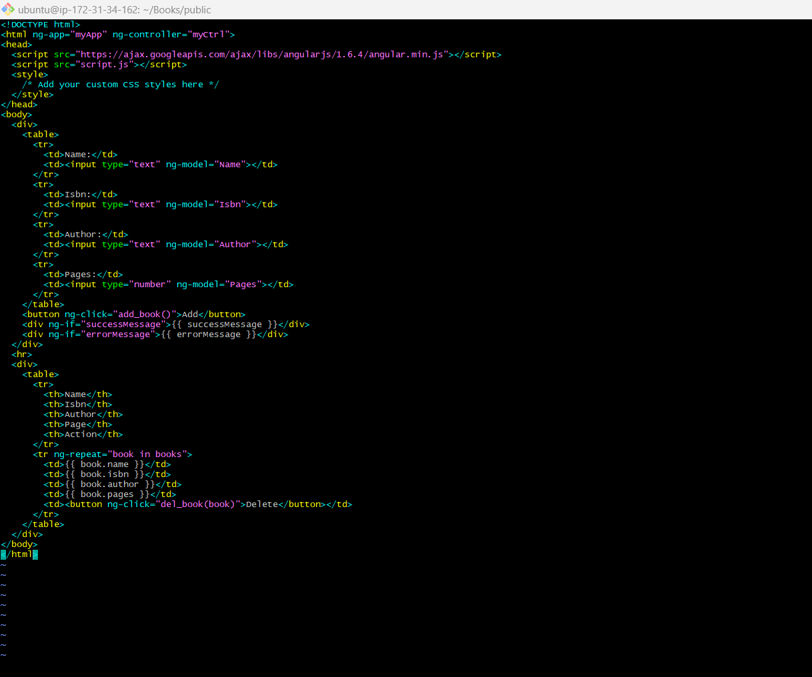

6. Change the directory back to Books:
```bash
cd ..
```

7. Start the server by running the command below:

```bash
node server.js
```
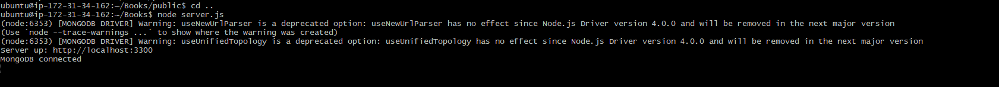

8. To access the web app from our public IP on our browser, edit the inbound rules on the AWS security group for the current instance to include port 3300, as shown below:
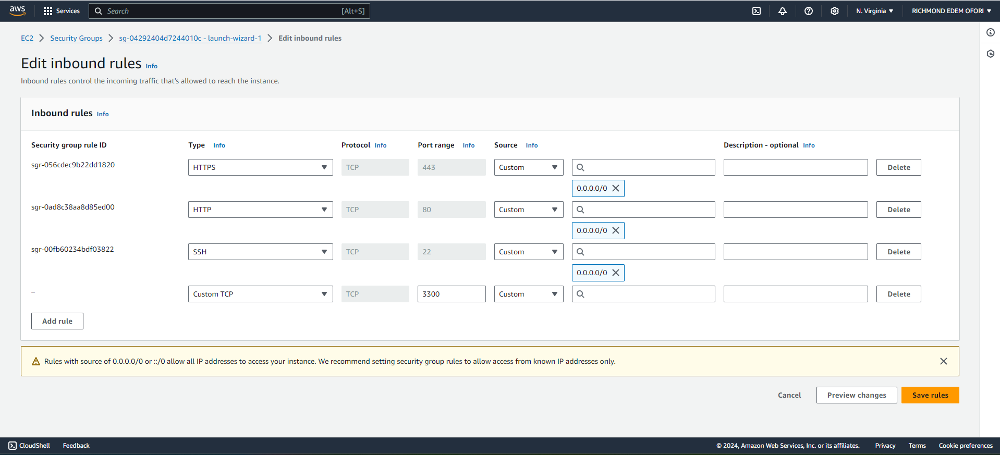

Finally, the web app can be accessed at <public-ip>:3300:


