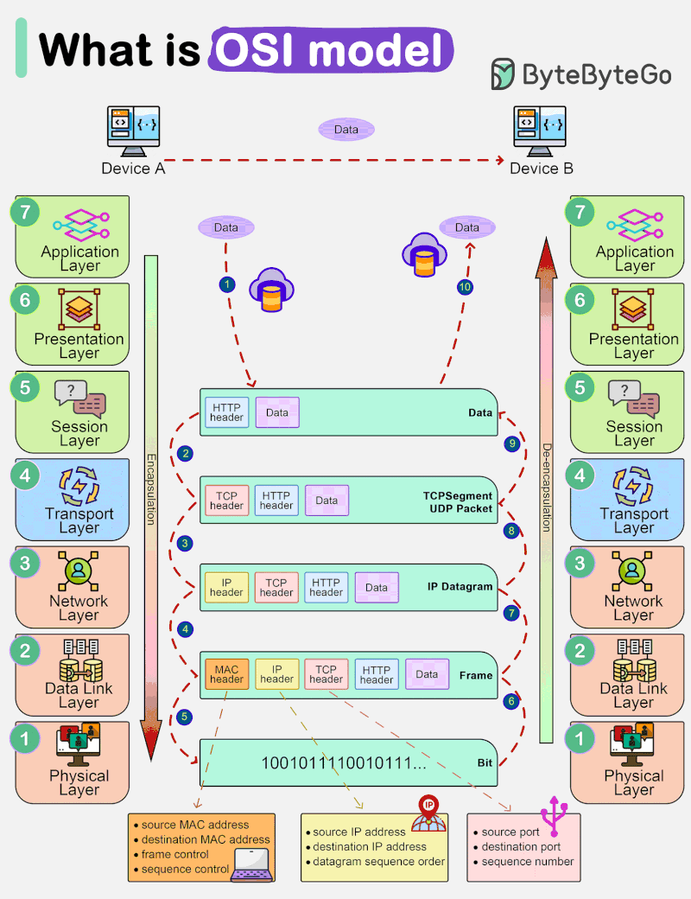
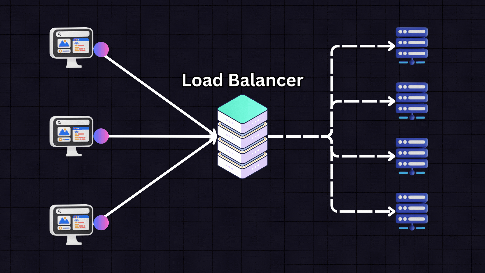

# Understanding the OSI Model.

## Introduction

The OSI (Open Systems Interconnection) model is a conceptual framework that standardizes the functions of a communication system into seven distinct layers. It was developed by the International Organization for Standardization (ISO) to facilitate interoperability between different computer systems and ensure seamless communication. Each layer of the OSI model has a specific set of responsibilities and interacts with the layers above and below it.

We will now delve into the details of the OSI model, exploring each layer and its functions, and understanding how they work together to enable effective communication.

### Table of Contents

1. [What is the OSI Model?](#what-is-the-osi-model)
2. [The Seven Layers of the OSI Model](#the-seven-layers-of-the-osi-model)
   1. [Physical Layer](#physical-layer)
   2. [Data Link Layer](#data-link-layer)
   3. [Network Layer](#network-layer)
   4. [Transport Layer](#transport-layer)
   5. [Session Layer](#session-layer)
   6. [Presentation Layer](#presentation-layer)
   7. [Application Layer](#application-layer)
3. [Understanding Layer Interaction](#understanding-layer-interaction)
4. [FAQ](#faq)
   1. [What is the purpose of the OSI model?](#what-is-the-purpose-of-the-osi-model)
   2. [Why are there seven layers in the OSI model?](#why-are-there-seven-layers-in-the-osi-model)
   3. [What is the role of the physical layer in the OSI model?](#what-is-the-role-of-the-physical-layer-in-the-osi-model)
   4. [How does the transport layer ensure reliable data delivery?](#how-does-the-transport-layer-ensure-reliable-data-delivery)
   5. [What is the significance of the application layer in the OSI model?](#what-is-the-significance-of-the-application-layer-in-the-osi-model)

### What is the OSI Model? 

The OSI model is a conceptual framework that defines the functions of a communication system. It provides a standardized way of understanding and implementing network protocols, ensuring compatibility and interoperability between different systems. The model is divided into seven layers, each responsible for specific tasks related to data transmission and communication. By separating the communication process into distinct layers, the OSI model simplifies the design, implementation, and troubleshooting of network systems.

### The Seven Layers of the OSI Model 

#### 1. Physical Layer 

The physical layer is the lowest layer of the OSI model and deals with the physical transmission of data. It defines the electrical, mechanical, and procedural aspects of communication, including the physical medium (cables, fibers, etc.) and the signaling methods used. The physical layer's primary function is to transmit raw bits over the network without any regard for the meaning or structure of the data.

#### 2. Data Link Layer 

The data link layer is responsible for the reliable transmission of data between adjacent network nodes. It provides error detection and correction mechanisms to ensure data integrity and handles the flow control between the sender and receiver. The data link layer is divided into two sublayers: the Logical Link Control (LLC) sublayer, which deals with error control and flow control, and the Media Access Control (MAC) sublayer, which manages access to the physical medium.

#### 3. Network Layer 

The network layer is responsible for the logical addressing and routing of data packets across multiple networks. It determines the optimal path for data transmission, considering factors such as network congestion, network topology, and the availability of routes. The network layer also performs packet fragmentation and reassembly, allowing data to be transmitted in smaller, manageable units.

#### 4. Transport Layer 

The transport layer ensures reliable and efficient data delivery between end systems. It breaks down large data streams into smaller segments and reassembles them at the receiving end. The transport layer also provides error detection and correction, flow control, and congestion control mechanisms. It establishes end-to-end connections, manages data sequencing, and guarantees the reliable delivery of data.

#### 5. Session Layer 

The session layer establishes, manages, and terminates communication sessions between applications. It provides mechanisms for session establishment, synchronization, and checkpointing. The session layer also handles session recovery in case of failures and manages the security and authentication of sessions.

#### 6. Presentation Layer 

The presentation layer is responsible for the formatting, encryption, and compression of data. It ensures that the data is in a format that can be understood by the receiving system. The presentation layer also handles data encryption and decryption to provide secure communication. It is responsible for data compression to optimize bandwidth usage and improve transmission efficiency.

#### 7. Application Layer 

The application layer is the topmost layer of the OSI model and is responsible for providing services to end-user applications. It includes protocols and services that enable communication between applications and facilitate tasks such as file transfer, email, web browsing, and remote access. The application layer interacts directly with the end-user and provides a user-friendly interface for accessing network resources.

### Understanding Layer Interaction 

The layers of the OSI model interact with each other to ensure effective communication. Each layer performs specific functions and relies on the services provided by the layers below it. When data is transmitted from the sender to the receiver, it passes through each layer, with each layer adding its own header and removing it at the receiving end.

The process of data transmission starts at the application layer, where the data is generated. The application layer passes the data to the presentation layer, which formats and encrypts it if required. The presentation layer then passes the data to the session layer, which establishes a session with the receiving application.

The session layer passes the data to the transport layer, which breaks it down into smaller segments and adds a transport layer header. The transport layer then passes the segments to the network layer, which adds a network layer header containing the logical addresses of the sender and receiver.

The network layer determines the optimal path for data transmission and adds a network layer header. The data is then passed to the data link layer, which adds a data link layer header and performs error detection and correction. Finally, the physical layer transmits the data over the physical medium.

At the receiving end, the process is reversed. The physical layer receives the data and passes it to the data link layer, which performs error detection and correction. The data link layer then passes the data to the network layer, which removes the network layer header and determines the destination address.

The network layer passes the data to the transport layer, which removes the transport layer header and reassembles the segments into the original data stream. The transport layer then passes the data to the session layer, which removes the session layer header and passes the data to the presentation layer.

The presentation layer removes the presentation layer header and decrypts the data if required. Finally, the application layer receives the data and presents it to the end-user application.

### FAQ 

#### 1. What is the purpose of the OSI model? 

The OSI model serves as a framework for understanding and implementing network protocols. It ensures compatibility and interoperability between different systems by defining the functions of each layer and the interactions between them.

#### 2. Why are there seven layers in the OSI model? 

The seven layers of the OSI model provide a structured approach to network communication. Each layer has specific responsibilities, allowing for modular design, ease of troubleshooting, and the ability to replace or upgrade individual layers without affecting the entire system.

#### 3. What is the role of the physical layer in the OSI model? 

The physical layer is responsible for the physical transmission of data. It defines the physical medium, signaling methods, and electrical and mechanical aspects of communication. The physical layer ensures that raw bits are transmitted over the network without any regard for the meaning or structure of the data.

#### 4. How does the transport layer ensure reliable data delivery? 

The transport layer ensures reliable data delivery by breaking down large data streams into smaller segments and reassembling them at the receiving end. It provides error detection and correction mechanisms, flow control, and congestion control to guarantee the reliable and efficient delivery of data.

#### 5. What is the significance of the application layer in the OSI model? 

The application layer is the interface between the network and the end-user. It includes protocols and services that enable communication between applications and facilitate tasks such as file transfer, email, web browsing, and remote access. The application layer provides a user-friendly interface for accessing network resources and is responsible for delivering data to the end-user.

### Conclusion

The OSI model is a fundamental concept in computer networking, providing a standardized framework for understanding and implementing network protocols. By dividing the communication process into seven distinct layers, the OSI model simplifies the design, implementation, and troubleshooting of

# Load Balancing: Optimizing Performance and Reliability

## Introduction

In today's digital landscape, where websites and applications are expected to deliver seamless user experiences, load balancing has become a critical component of any robust infrastructure. Load balancing refers to the distribution of incoming network traffic across multiple servers to ensure optimal performance, high availability, and reliability. By intelligently distributing the workload, load balancing helps prevent server overload, reduces downtime, and enhances scalability.

We will now explore the concept of load balancing, its benefits, different load balancing techniques, and how it can be effectively implemented to optimize performance and reliability.

### Table of Contents

1. [What is Load Balancing?](#what-is-load-balancing)
2. [Benefits of Load Balancing](#benefits-of-load-balancing)
3. [Load Balancing Techniques](#load-balancing-techniques)
   1. [Round Robin](#round-robin)
   2. [Least Connection](#least-connection)
   3. [Weighted Round Robin](#weighted-round-robin)
   4. [IP Hash](#ip-hash)
4. [Implementing Load Balancing](#implementing-load-balancing)
5. [FAQ](#faq)
   1. [What is server overload?](#what-is-server-overload)
   2. [How does load balancing prevent server overload?](#how-does-load-balancing-prevent-server-overload)
   3. [Can load balancing improve scalability?](#can-load-balancing-improve-scalability)
   4. [What is high availability in the context of load balancing?](#what-is-high-availability-in-the-context-of-load-balancing)
   5. [Is load balancing only applicable to web servers?](#is-load-balancing-only-applicable-to-web-servers)

### What is Load Balancing? 

Load balancing is a technique used to distribute incoming network traffic across multiple servers or resources to ensure optimal utilization and performance. It acts as a mediator between the client and the server, intelligently routing requests to the most appropriate server based on various factors such as server health, current load, and proximity. By evenly distributing the workload, load balancing prevents any single server from becoming overwhelmed, thereby reducing the risk of downtime and improving overall system performance.

### Benefits of Load Balancing 

#### 1. Enhanced Performance

One of the primary benefits of load balancing is improved performance. By distributing incoming traffic across multiple servers, load balancing ensures that no single server is overloaded with requests. This results in faster response times and improved user experience. Load balancing also allows for efficient resource utilization, as it enables servers to handle a higher volume of requests without compromising performance.

#### 2. High Availability and Reliability

Load balancing plays a crucial role in ensuring high availability and reliability of services. By distributing traffic across multiple servers, load balancing eliminates single points of failure. If one server fails or becomes unavailable, the load balancer automatically redirects traffic to other available servers, minimizing downtime and ensuring uninterrupted service for users.

#### 3. Scalability

Load balancing enables horizontal scalability by allowing new servers to be added to the infrastructure seamlessly. As the demand for resources increases, additional servers can be added to the pool, and the load balancer will intelligently distribute the workload across all available servers. This scalability ensures that the system can handle increased traffic and maintain optimal performance even during peak usage periods.

#### 4. Flexibility and Adaptability

Load balancing provides flexibility and adaptability to the infrastructure. It allows for easy addition or removal of servers without affecting the overall system performance. This flexibility enables organizations to scale their infrastructure based on changing demands, ensuring that resources are efficiently utilized and costs are optimized.

### Load Balancing Techniques 

There are various load balancing techniques that can be employed based on the specific requirements of the infrastructure. Let's explore some commonly used techniques:

#### 1. Round Robin 

Round Robin is a simple and widely used load balancing technique. In this method, incoming requests are distributed across servers in a cyclic manner. Each server is assigned a turn to handle the incoming request, and subsequent requests are distributed sequentially. Round Robin is easy to implement and ensures an equal distribution of requests among servers. However, it does not take into account the server's current load or performance, which can lead to inefficient resource allocation.

#### 2. Least Connection 

The Least Connection method directs incoming requests to the server with the fewest active connections at the time of the request. This technique ensures that the workload is distributed evenly among servers based on their current load. By dynamically adjusting theweightage of each server based on the number of connections, the load balancer can effectively distribute the load and prevent any single server from becoming overwhelmed.

#### 3. Weighted Round Robin 

Weighted Round Robin is an extension of the Round Robin technique that assigns a weight or priority to each server in the pool. Servers with higher weights receive a larger proportion of incoming requests, while servers with lower weights handle a smaller portion. This technique allows for more granular control over the distribution of workload, enabling administrators to allocate resources based on server capacity and performance.

#### 4. IP Hash 

The IP Hash method uses the client's IP address to determine which server should handle the request. The load balancer calculates a hash value based on the client's IP address and uses it to select the server. This technique ensures that requests from the same client are consistently routed to the same server, maintaining session persistence. IP Hash is commonly used in scenarios where maintaining session state is crucial, such as e-commerce applications.

### Implementing Load Balancing 

Implementing load balancing requires careful planning and consideration of the specific needs of the infrastructure. Here are some key steps to follow:

1. **Identify the Load Balancing Strategy**: Determine the load balancing technique that best suits your infrastructure and application requirements. Consider factors such as scalability, performance, and session persistence.

2. **Choose a Load Balancer**: Select a load balancing solution that aligns with your infrastructure and budget. There are hardware-based load balancers, software-based load balancers, and cloud-based load balancers available. Evaluate their features, scalability, and ease of management before making a decision.

3. **Configure Load Balancer**: Set up the load balancer by configuring the necessary parameters such as server health checks, load balancing algorithms, and session persistence settings. Ensure that the load balancer is properly integrated with your servers and network infrastructure.

4. **Monitor and Optimize**: Regularly monitor the performance of your load balancer and make necessary adjustments to optimize its efficiency. Keep an eye on server health, traffic patterns, and response times to identify any bottlenecks or performance issues.

5. **Scale as Needed**: As your infrastructure grows and demands increase, be prepared to scale your load balancing solution accordingly. Add additional servers or upgrade your load balancer to accommodate the increased workload.

By following these steps, organizations can effectively implement load balancing and reap the benefits of improved performance, high availability, and scalability.

### FAQ 

#### 1. What is server overload? 

Server overload refers to a situation where a server is unable to handle the incoming requests or workload due to resource limitations. It can lead to slow response times, system crashes, and overall degradation of performance.

#### 2. How does load balancing prevent server overload? 

Load balancing prevents server overload by distributing incoming requests across multiple servers. This ensures that no single server is overwhelmed with traffic, allowing for efficient resource utilization and improved performance. If one server becomes overloaded or unavailable, the load balancer redirects traffic to other available servers, preventing downtime and maintaining service availability.

#### 3. Can load balancing improve scalability? 

Yes, load balancing plays a crucial role in improving scalability. By distributing the workload across multiple servers, load balancing enables organizations to handle increased traffic and scale their infrastructure seamlessly. New servers can be added to the pool, and the load balancer will intelligently distribute the workload, ensuring optimal performance and scalability.

#### 4. What is high availability in the context of load balancing? 

High availability in load balancing refers to the ability of the infrastructure to provide uninterrupted service even in the event of server failures or downtime. By distributing traffic across multiple servers, load balancing eliminates single points of failure and ensures that services remain available to users.

#### 5. Is load balancing only applicable to web servers? 

No, load balancing is not limited to web servers. While it is commonly used in web server environments to handle HTTP requests, load balancing can be applied to various types of servers and services, including database servers, application servers, and email servers. It helps optimize performance and ensure high availability for any resource-intensive workload.

### Conclusion

Load balancing is a crucial component of modern infrastructure, enabling organizations to optimize performance, enhance reliability, and improve scalability. By intelligently distributing incoming traffic across multiple servers, load balancing ensures efficient resource utilization, prevents server overload, and provides high availability for services. With various load balancing techniques available, organizations can choose the most suitable approach based on their specific needs. By implementing
